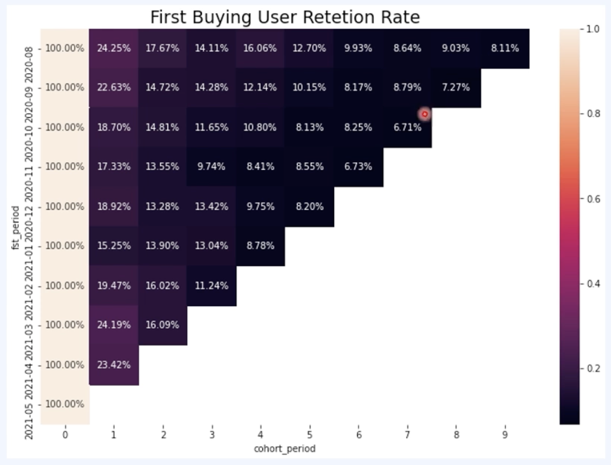
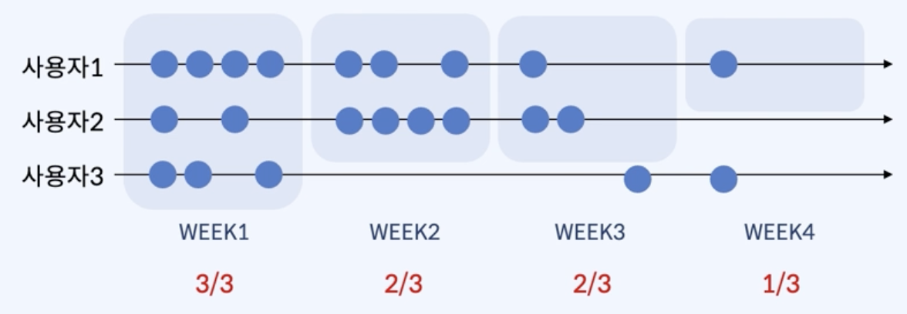
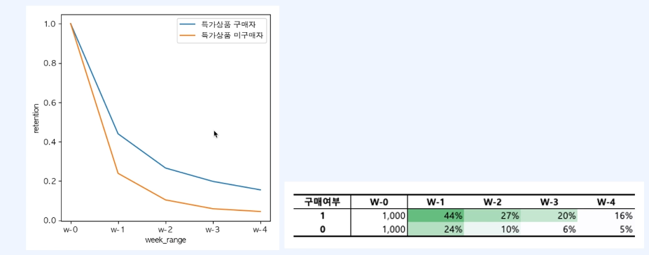

# [DA] Cohort 분석

### 📍Cohort 분석

- **코호트란 ?** 특정 기간 동안 공통된 특성이나 경험을 갖는 사용자 집단을 의미
- **코호트 분석 ?** 시간을 두고 비슷한 그룹을 비교하는 방법
- ex.
    - 최근 유입 고객의 가입전환율이 낮아짐
        
        → 광고채널별 유입고객 코호트 분석
        
    - 첫 구매 특가상품 프로모션 진행 여부 고민중
        
        → 첫 구매 특가상품 구매 여부에 따라 코호트 분석 
        
                        
    

### 📍AARRR(해적지표)

- **그로스 해킹 ?** 사업의 핵심지표를 발굴하고, 성장시키는 방법을 찾는 활동
- AARRR은 사용자 행동방식 5단계 지표
    
    ```python
    사용자 유치(Acquisition)
    	-> 사용자 활성화(Activation)
    		-> 사용자 유지(Retention)
    			-> 추천(Referral)
    				-> 매출(Revenue)
    				
    * 활성화와 유지율이 가장 먼저 개선 필요! 
    ```
    

### 📍리텐션에 대한 이해

- 리텐션 ? 고객 유지율로 서비스의 성공을 예측할 수 있는 가장 기본적인 핵심 지표
- 리텐션 측정 방법
    - 특정 기간 내에 이벤트를 발생시킨 유저의 비율을 계산
    - 기간 내 1번 이상의 이벤트가 관측되면 한 번으로 카운트
    - **Retention = 측정 Week 기간 내 서비스 이용 고객 수 / Week1 서비스 이용 고객 수**
        
               
        
    - Retention을 누적 사용자만 볼지, 아닐지는 보고자 하는 데이터의 성격에 맞게 설정

### 📍문제인식 ~ 가설수립 ~ 결론도출

1. 주제
    - 첫구매 특가상품을 구매한 고객이 유지가 더 잘 될 것인가 ?
2. 문제인식 배경
    - 첫구매 특가상품 프로모션은 타 마케팅 활동 대비 고객획득비용(CAC)가 비싸다.
    - 그럼에도 첫구매 특가상품 프로모션은 고객에게 첫인상을 좋게 남겨주어 잔존 가능성이 더 높을 것 같은데 🤔
    - 한편으로는 이를 악이용하는 체리피커 고객만 데리고 오는 것은 아닌지 걱정도 됨 🙄
    - 해당 프로모션을 유지해야 할지 말아야 할지 고민하고 있지만 의사결정을 위한 명확한 근거가 없는 상황
3. 데이터
    1. **가설수립: 첫구매 특가상품 구매 고객은 리텐션이 더 높을 것이다.**
    2. **종속변수: 고객 유지율(리텐션)**
    3. **독립변수: 첫구매 특가상품 구매 여부(1: 구매 / 0: 미구매)**
    4. 측정인원: 첫구매 특가상품 구매자 1,000명 / 미구매자 1,000명
    5. 기준기간: 1월 한 달간 첫구매 고객(1월 w1 주문고객 기준으로 w4까지 리텐션 비교)
4. sql 데이터 분석

```sql
-- 첫 주문 테이블 
select * from first_ord_table; 

-- 오더마스터 테이블
select * from order_master_cohort ; 

-- 두 테이블 조인
select * 
from first_ord_table fot 
left join order_master_cohort omc 
on fot.mem_no = omc.mem_no ;

-- 코호트 분석에 필요한 데이터 집계
with t1 as (  
select distinct fot.mem_no,
       is_promotion,
       CASE 
           WHEN ord_dt = first_ord_dt THEN 0 
           WHEN ord_dt > first_ord_dt AND ord_dt <= DATE_ADD(first_ord_dt, INTERVAL 7 DAY) THEN 1
           WHEN ord_dt > DATE_ADD(first_ord_dt, INTERVAL 7 DAY) 
                AND ord_dt <= DATE_ADD(first_ord_dt, INTERVAL 14 DAY) THEN 2
           WHEN ord_dt > DATE_ADD(first_ord_dt, INTERVAL 14 DAY) 
                AND ord_dt <= DATE_ADD(first_ord_dt, INTERVAL 21 DAY) THEN 3
           WHEN ord_dt > DATE_ADD(first_ord_dt, INTERVAL 21 DAY) 
                AND ord_dt <= DATE_ADD(first_ord_dt, INTERVAL 28 DAY) THEN 4
           ELSE NULL 
       END AS week_num  # 첫 주문일 기준 7,14,21,28일 이내를 week_num 넘버링
from first_ord_table fot 
left join order_master_cohort omc 
on fot.mem_no = omc.mem_no
)
, t2 as (
select is_promotion
	, mem_no
	, week_num  
	, row_number() over (partition by mem_no order by week_num) as seq
from t1
where week_num is not null 
order by 1,2,3,4 
)

select is_promotion
	, case when week_num = 0 then '1.w-0'
		   when week_num = 1 and seq = 2 then '2.w-1'
		   when week_num = 2 and seq = 3 then '3.w-2'
		   when week_num = 3 and seq = 4 then '4.w-3'
		   when week_num = 4 and seq = 5 then '5.w-4'
		   end as week_range
	, count(mem_no) as mem_cnt
from t2
group by 1,2 
order by 1,2 ;
```

5. 결론도출
    
    !       
        
    - 특가상품 구매 코호트가 1주가 지난 시점부터 높은 리텐션을 보임
        - 구매한 고객과  구매 안 한 고객 차이가 20%이상의 큰 차이. 유의미한 차이.
    - 첫구매 특가상품 프로모션을 유지하는 방향으로 의사결정
