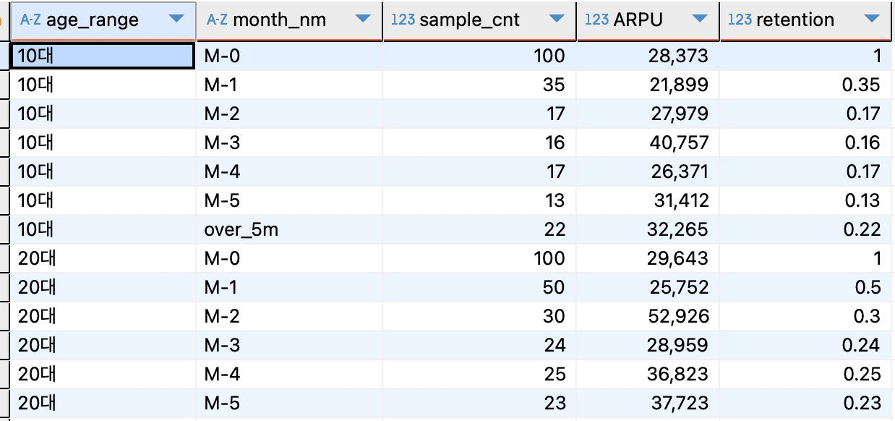
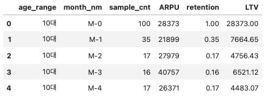

# [DA] LTV 산출

### 📍LTV (Lifetime Value, CLV)

- 고객 생애 가치로 유저가 서비스를 사용하는 기간 동안 창출하는 매출
- LTV 활용 사례
    - **신규 고객 획득비용(CAC) 기준 설정**
    - 효율적인 마케팅 채널을 파악하여 예산 분배
- LTV 계산법
    - **LTV = ARPU * 리텐션**
        - **ARPU = 유저당 주문금액 (매출/유저수)**
        - 그룹을 코호트로 쪼개어서 LTV 비교 분석

### 📍새벽배송 플랫폼의 핵심 고객 연령층 알아보기

1. 측정인원: 2023년 1월에 첫 주문한 고객 중 10대 ~ 50대까지 **연령대별 100명 (총 500명)**
2. 분석방법: 2023년 1월에 첫 주문한 고객의 **6개월 간의 연령대별 인당 누적 LTV 계산**
    
    | 20대  | 첫 주문자수 | 리텐션 | ARPU   | 인당 LTV  |
    |------|----------|-------|--------|--------|
    | 1월 (M-0) | 100      | 100%  | 29,643  | 29,643  |
    | 2월 (M-1) |          | 50%   | 25,855  | 12,927  |
    | 3월 (M-2) |          | 30%   | 53,097  | 15,929  |
    | 4월 (M-3) |          | 24%   | 28,959  | 6,950   |
    | 5월 (M-4) |          | 25%   | 36,823  | 9,205   |
    | 6월 (M-5) |          | 23%   | 37,723  | 8,676   |

    **20대 1월 첫주문자의 6개월 누적 LTV: 83,331**

    
3. SQL 로 분석하기
    
    ```sql
    with ord as (
    	select a.mem_no
    		,b.age_range
    		,b.first_ord_dt
    		,a.ord_dt
    		,a.order_amount
    	from order_master_ltv a
    	left join first_ord_table_ltv b on a.mem_no = b.mem_no
    	)
    , cohort as (
    	select age_range
    		,case when first_ord_dt = ord_dt then 'M-0'
    			  when first_ord_dt < ord_dt and ord_dt <= DATE_ADD(first_ord_dt, INTERVAL 1 MONTH) then 'M-1'
    			  when ord_dt > DATE_ADD(first_ord_dt, INTERVAL 1 MONTH) and ord_dt <= DATE_ADD(first_ord_dt, INTERVAL 2 MONTH) then 'M-2'
    			  when ord_dt > DATE_ADD(first_ord_dt, INTERVAL 2 MONTH) and ord_dt <= DATE_ADD(first_ord_dt, INTERVAL 3 MONTH) then 'M-3'
    			  when ord_dt > DATE_ADD(first_ord_dt, INTERVAL 3 MONTH) and ord_dt <= DATE_ADD(first_ord_dt, INTERVAL 4 MONTH) then 'M-4'
    			  when ord_dt > DATE_ADD(first_ord_dt, INTERVAL 4 MONTH) and ord_dt <= DATE_ADD(first_ord_dt, INTERVAL 5 MONTH) then 'M-5'
    			  else 'over_5m' end as month_nm
    		,count(distinct mem_no) as sample_cnt
    		,round(avg(order_amount)) as ARPU
    	from ord
    	group by 1,2
    	order by 1,2 )
    	
    	
    select age_range
    	,month_nm
    	,sample_cnt
    	,ARPU
    	,sample_cnt * 1.00 / max(sample_cnt) over (partition by age_range) as retention
    from cohort
    order by 1,2 ;
    ```
    
    
    
    ```python
    import pandas as pd
    df = pd.read_csv('/Users/ann/ltv.csv', encoding = 'utf-8')
    df['LTV'] = df['ARPU']*df['retention']
    ```
    
    
    
    ```python
    df2 = df[df['month_nm'] != 'over_5m']
    ltv = df2.groupby('age_range')['LTV'].sum().reset_index()
    ltv
    ```
    
    | age_range | LTV |
    | --- | --- |
    | 10대 | 55881.83 |
    | 20대 | 83229.00 |
    | **30대** | **112074.93** |
    | 40대 | 94311.77 |
    | 50대 | 96026.73 |
    
    → 1월에 첫 주문한 10대가 인당 6개월 동안 5만 5천원정도를 지출한다. 
    
4. 결론
- 23년 1월 가입자 중 **30대**가 첫주문 이후 5개월까지 가장 높은 LTV를 나타냄

