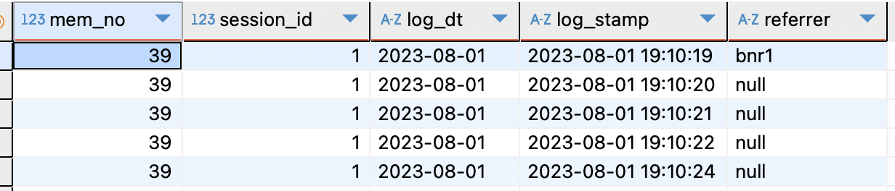
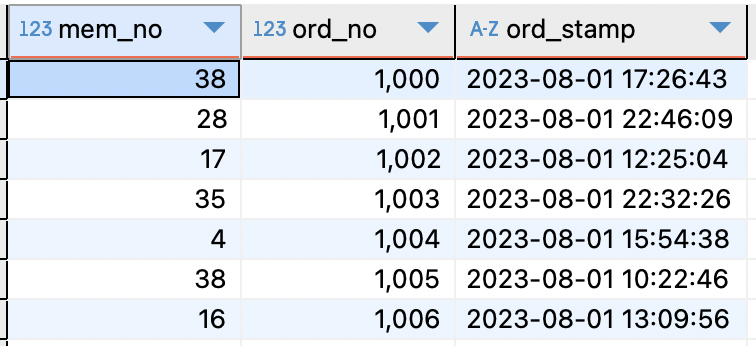
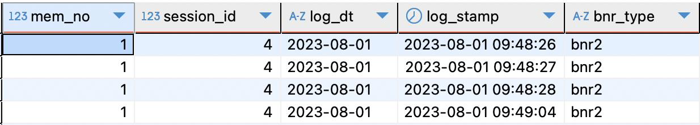
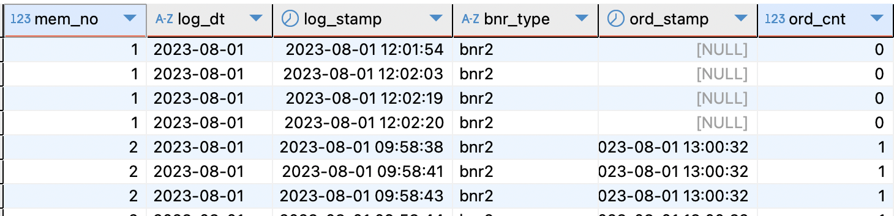
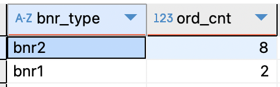

# [DA] 로그데이터 분석

출발~: 2025/03/07
파트: DA

### 📍로그데이터 ?

- 고객이 서비스에 유입되어 남기는 행동 데이터
- 유입, 페이지 이동, 노출, 클릭 등 데이터가 이벤트 단위로 적재됨
- 테이블이 무거운 편이고, 서비스에 대한 완벽한 이해가 없다면 데이터 활용이 어려움
- ex
    - 서비스/프로덕트 개선
    - 고객 행동 기반 데이터 분석

### 📍어떤 배너를 통해 유입된 고객의 주문 전환율이 더 높을까 ?

1. 종속변수 : 주문전환 여부(1: 배너를 통해 유입된 후 주문을 했을 경우 / 0: 배너를 통한 주문이 없는 경우)
2. 독립변수 : 배너 유형(bnr1 / bnr2)
3. 측정인원 : 40명
4. `log_table`
    *bnr1 = bnr1을 클릭해서 유입됨
    
    
    
    `order_master_log`
    
    
    
5. sql 분석
    
    ```sql
    with log as (
    	select distinct mem_no
    		, session_id
    		, log_dt
    		, CAST(log_stamp AS DATETIME)  as log_stamp
    		, min(referrer) over (partition by mem_no order by log_stamp) as bnr_type
    			# bnr_type에는 bnr1/2 이거나 null 값 -> bnr1/2 값만 가져오기 
    	from log_table
    )
    ```
    
    
    
    ```sql
    , ord as (
    	select distinct a.mem_no
    			, log_dt
    			, log_stamp
    			, bnr_type
    			, CAST(ord_stamp as DATETIME) as ord_stamp
    			, count(distinct ord_no) as ord_cnt
    		from log a 
    		left join order_master_log b 
    			on a.mem_no = b.mem_no
    			and log_dt = str_to_date(ord_stamp,'%Y-%m-%d') 
    			#oml에는 order_no가 없다면, 로그스탬프와 오더스탬프를 활용해 조인 
    			#oml에는 시분초 포함 stamp 로그만 있어서 'YYYY-mm-dd'형으로 바꿈 
    			and log_stamp < CAST(ord_stamp as DATETIME) 
    			-- and a.session_id = b.session_id
    		group by 1,2,3,4,5
    )
    ```
    
    
    
    ```sql
    , ord2 as (
    	select distinct mem_no
    			, bnr_type
    			, case when ord_cnt >= 1 then 1 else 0 end as is_ord
    			# 한 멤버가 2건 이상 주문했어도 1=주문함 으로 바꿈 
    	from ord
    )
    
    select bnr_type
    	, sum(is_ord) as ord_cnt
    from ord2
    group by 1 ;
    ```
    
    
    
    → 각각의 샘플 사이즈가 같고, bnr2가 bnr1보다 4배 더 큰 주문률. (다만 작은 샘플 데이터이기 때문에 유의미한 차이라고 말하기 어려움.)
