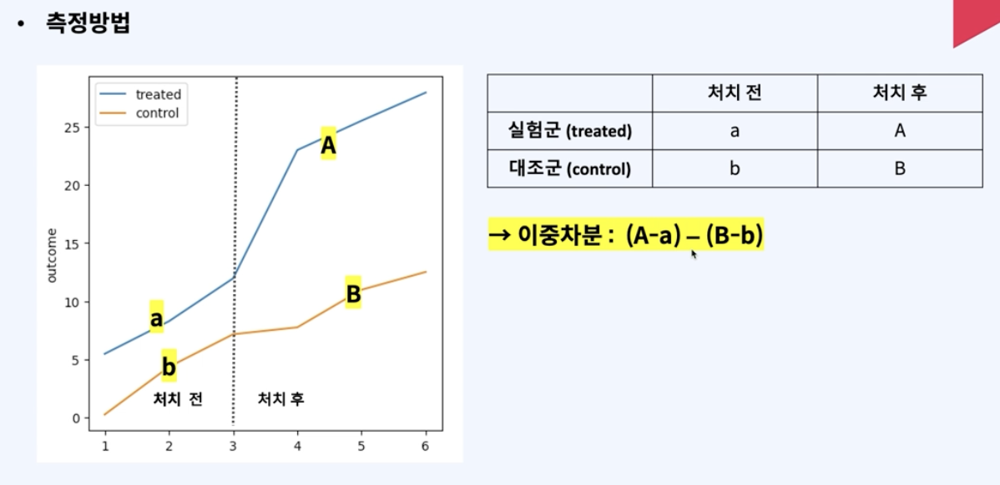
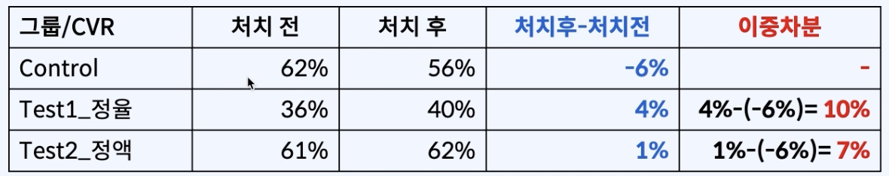

# [DA] 이중차분법
### 📍A/B 테스트

- A와 B를 대조하여 가설을 검정하는 실험방법
    즉, 결과와 상관성이 높다고 생각되는 변수를 테스트를 통해 검정하는 방법
    
- ex
    - 가설1: 배너 위치를 변경하면 CTR(클릭전환율)이 증가할 것이다.
    - 가설2: 장바구니 팝업 문구 변경하면 CVR(주문전환율)이 증가할 것이다.
    - 가설3: 5% 할인쿠폰보다 5천원 할인쿠폰이 주문이 더 많이 일어날 것이다.
    - 상관성이 높은 독립변수를 찾아서 개선, 매출 높이고자.
- 단점
    - A/B Test 설계 시, 샘플 사이즈 및 실험기간 계산, 유의성 검증 등 고급 통계지식 기반
    - 설정한 독립변수 이외의 변수들을 완벽하게 통제하기 어려움
    - 경우에 따라 테스트 비용이 많이 든다.

### 📍이중차분법

- 독립변수와 종속변수 간 인과 효과를 측정하기 위한 인과추론법
- 실험군(TREATMENT): 실험자가 종속변수와 상관성이 높아 보이는 독립변수에 변화를 주는 그룹
- 대조군(CONTROL): 실험군과 대조하기 위해 처치를 하지 않는 그룹
- 대조군과 실험군 두 그룹의 처치 시점 전후 지표 비교
    - 즉, 트리트먼트 그룹의 처치 없이도 나타날 결과를 측정하기 위함으로, 컨트롤 그룹의 처치 전후 지표와 시계열 데이터 비교



### 📍문제인식 ~ 가설수립 ~ 결론도출

1. 주제
    - 5천원 할인쿠폰 vs 5% 할인쿠폰, 주문 전환율이 더 높은 것은 ?
2. 문제인식 배경
    - 프로젝트: 이탈고객 복귀 프로젝트
    - 목표: 테스트 기반의 고효율 쿠폰 발굴 및 이탈고객 복귀율 제고
    - 할인혜택
        
        
        | **쿠폰종류** | **쿠폰명** | **최소주문금액** | **최대 할인금액** |
        | --- | --- | --- | --- |
        | 정액쿠폰 | 5천원 할인쿠폰 | 100,000원 | 5,000원 |
        | 정율쿠폰 | 5% 할인쿠폰 | 100,000원 | 7,000원 |
3. 실습 데이터 
    1. 가설수립: 정액이 기재되어 있는 할인쿠폰의 주문전환율이 더 높을 것이다.
    2. 종속변수: 주문전환율(1: 실험기간 중 주문이 1번이라도 있는 경우 / 0: 실험기간 중 주문이 없는 경우)
    3. 독립변수: 쿠폰유형(5천원 할인쿠폰 vs 5% 할인쿠폰)
    4. 대조그룹: 쿠폰 미지급 100명
    5. 실험그룹: 5천원 할인쿠폰 100명 / 5% 할인쿠폰 100명
    6. 관찰기관 6/12 쿠폰발급
        
        
        |  | 처치 이전 6/5~6/11 | 처치 이후 6/12~6/18  |
        | --- | --- | --- |
        | 실험 | 할인쿠폰x | 할인쿠폰o |
        | 대조 | 할인쿠폰x | 할인쿠폰x |
4. sql로 그룹별 주문수 집계
    
    ```sql
    -- 데이터 확인
    select * 
    from coupon_target_table ; 
    
    select *
    from order_master_did omd ; 
    
    -- 두 테이블 조인
    select *
    from coupon_target_table ctt 
    left join order_master_did omd
    on ctt.mem_no = omd.mem_no ;
    
    -- 이중차분법을 위한 그룹별 주문수 집계
    with t1 as (
    	select distinct omd.mem_no
    		,omd.ord_no
    		,ord_dt
    		,`group`
    		,case when ord_dt between '2023-06-05' and '2023-06-11' then '처치 전'
    			  when ord_dt between '2023-06-12' and '2023-06-18' then '처치 후' 
    			  end as period
    	from order_master_did omd 
    	left join coupon_target_table ctt
    	on omd.mem_no = ctt.mem_no
    )
    
    -- 관찰기간 동안 한 번이라도 주문을 완료하면 1로 카운트하기 위해 해당기간 주문이력 고객 unique count
    select distinct `group`
    	,period
    	,count(distinct mem_no) as ord_cnt
    from t1
    where period is not null
    group by 1,2 ;
    ```
    | group        | period | ord_cnt |
    |-------------|--------|--------|
    | CONTROL     | 처치 전 | 62     |
    | CONTROL     | 처치 후 | 56     |
    | TEST1_정율  | 처치 전 | 36     |
    | TEST1_정율  | 처치 후 | 40     |
    | TEST2_정액  | 처치 전 | 61     |
    | TEST2_정액  | 처치 후 | 62     |

    
5. 결론 도출  <br>

- Control : 쿠폰 안 받은, 어떤 처치도 받지 않은 자연스러운 결과. 시간에 따른 변화값
- Test1과 Test2의 결과값이 오로지 쿠폰 처치 때문이라고 할 수 없기 때문에 자연스러운 시간의 흐름에 따른 결과값을 한 번 더 뺌, 즉 이중차분 해줌
- Test1과 Test2의 이중차분값 차이가 3%.
    - 작아서 정율쿠폰과 정액쿠폰의 차이가 없다 = 정액쿠폰의 주문전환율이 더 높을 것이다 라는 가설을 drop할 수 있음
    - 하지만 주제, 도메인, 현업고려해서 해석 필요
 

